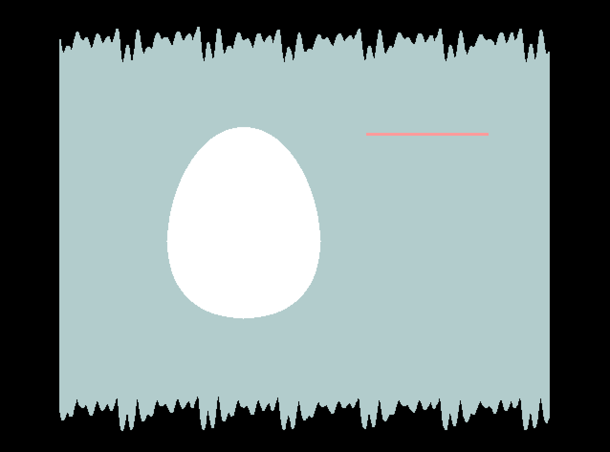
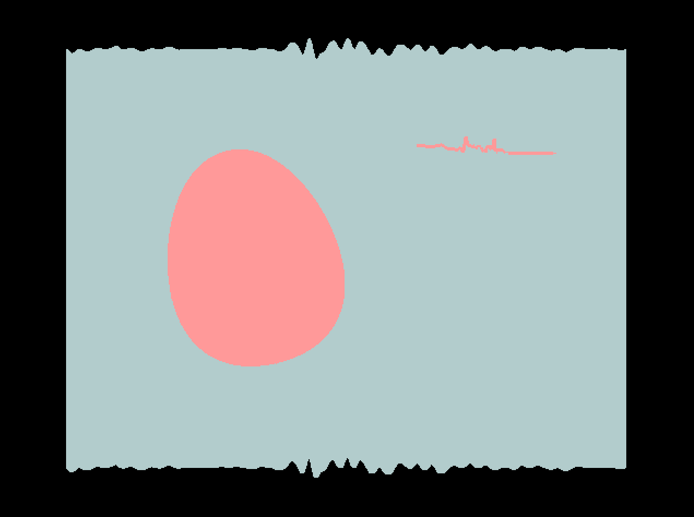

# Homework II


## Source code
[Hi, Egg~](https://github.com/iooops/Hi-Egg)

## Screenshots




## Build 

At the command line, enter
	
	make


## Run
### Usage:

````
't' - toggle chuck ring modulation
'f' - toggle fullscreen
'Q/q' - quit
````

## My idea  
It's fairly simple.
**I want to depict an egg on the stage. The stage(the cyan background) is controlled only by input. Initially, the chuck ring modulation is not activated. After activated, the egg will be turned to pink and it will start to wobble. Also, the spectrum next to it will start to show the output results.**


## Difficulties I encountered in the process

1. It took me a fairly long time to make clear how to show the log spectrum.
2. My initial intention was to record the input clip, then store it in the buffer and play it back afterwards (to avoid the realtime feedback). Still I don't know how to do it now. So I just did not implement it.


## Collaborators
* Yuval Adler

Also thanks to Jack Atherton(TA) and Ge Wang(Prof) for valuable advices and answers.